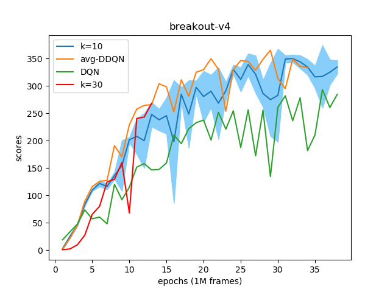

# Averaged-DQN
This is an unofficial Pytorch implementation project of 
paper: [Averaged-DQN: Variance Reduction and Stabilization
for Deep Reinforcement Learning](https://arxiv.org/pdf/1611.01929.pdf)

## Installation

ubuntu16.04:
```sh
conda env create -f environment.yml
```
## Usage
First activate virtual environment
```sh
conda activate gym
```
#### Examples:
For vanilla DQN training:
```sh
python DQN.py --checkpoint 
```
For averaged-DQN training:
```sh
python DQN.py --checkpoint --k 10
```
For averaged-DDQN training:
```sh
python DQN.py --checkpoint --k 10 --ddqn
```
For resume training:
```sh
python DQN.py --checkpoint --k 10 --resume --model model/weight.tar
```
## Arguments
| Argument      | Description   |
| ------------- | ------------- |
| --checkpoint  | save DQN model every epoch  |
| --k           | average k Q values, k = 1 is equal to vanilla DQN |
| --ddqn        | perform Double-DQN |
| --resume      | resume training |
| --model        | model path used in resume training |

## Evaluation
We use BreakoutNoFrameskip-v4 as experimental environment. The shaded area presents one standard deviation.


To evaluate the overestimation phenomenon, we use Gridworld as experimental environment since its optimal Q value can be easily computed. The result is shown below.


For more detail, you can refer to [GRIDWORLD.md](https://github.com/elephanting/Averaged-DQN-Pytorch/blob/master/gridworld/GRIDWORLD.md) in gridworld folder.

## Reference
* [Averaged-DQN: Variance Reduction and Stabilization for Deep Reinforcement Learning](https://arxiv.org/pdf/1611.01929.pdf)
* [Deep Reinforcement Learning with Double Q-learning](https://arxiv.org/pdf/1509.06461.pdf)
* [Human Level Control through Deep Reinforcement Learning](https://www.nature.com/nature/journal/v518/n7540/full/nature14236.html)
