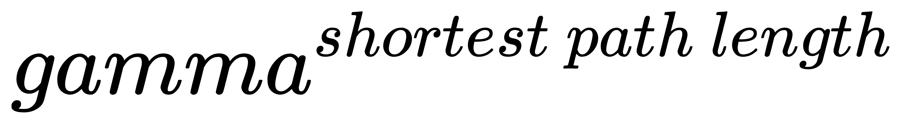
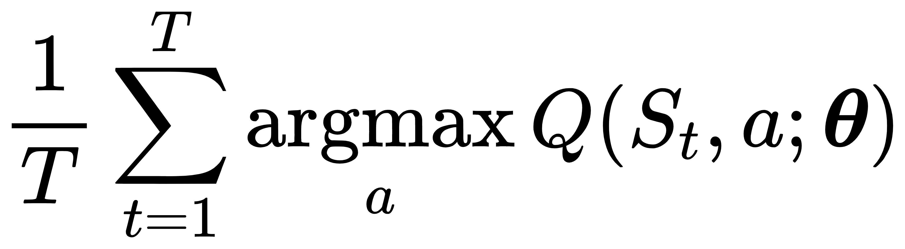
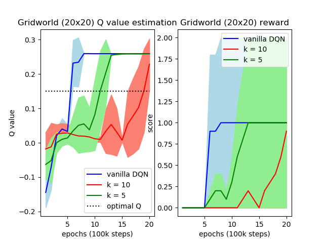
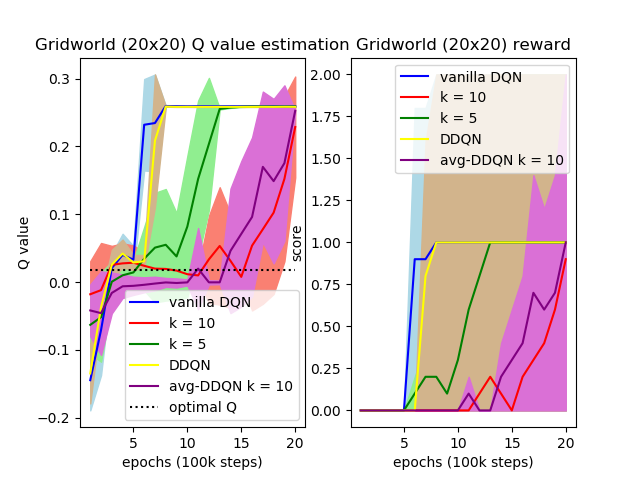

# Gridworld
The gridworld folder aims to experiment the ***overestimation phenomenon***.

Since the optimal Q value of Gridworld is deterministic, we can experiment the overestimation phenomenon between DQN and Averaged-DQN.

## Usage
The usage of gridworld folder is similar to the main folder

#### Examples:
For vanilla DQN training:
```sh
python train.py
```
For averaged-DQN training:
```sh
python train.py --k 10
```
For averaged-DDQN training:
```sh
python train.py --k 10 --ddqn
```

## Arguments
| Argument      | Description   |
| ------------- | ------------- |
| --k           | average k Q values, k = 1 is equal to vanilla DQN |
| --ddqn        | perform Double-DQN |
| --size      | size of square gridworld |

## Environment Setup
The starting point is default fixed at (0, 0) and ending point is at its diagonal point.

| Reward      | Description   |
| ------------- | ------------- |
| 1           | reach ending point and terminate current trajectory|
| -1        | reach illegal points and terminate current trajectory|
| 0      | else |

The experience replay buffer will be filled with all possible transitions before start training.

## Optimal Q value
According to [DDQN paper](https://arxiv.org/pdf/1509.06461.pdf), the optimal Q value is computed by ***The ground truth averaged values are obtained by running
the best learned policies for several episodes and computing the actual cumulative rewards***. The best learned policy in Gridworld is its shortest path from starting point to ending point. So optimal Q value will be



where gamma is discounted factor. For example, if size of gridworld is 20x20 and gamma is 0.9, it's shortest path will be 38 and the optimal Q value will be around 0.018.

## Evaluation of DQN, Averaged-DQN and DDQN
The testing Q value is computed every epoch and the formula is refered to [DDQN paper](https://arxiv.org/pdf/1509.06461.pdf):



The testing step size is set as 12500. The bold lines are averages over 10 independent learning trials and the shaded area presents one standard deviation.
### DQN and Averaged-DQN


### DQN, Averaged-DQN, DDQN and Averaged-DDQN(k = 10)


## Reference
* [Averaged-DQN: Variance Reduction and Stabilization for Deep Reinforcement Learning](https://arxiv.org/pdf/1611.01929.pdf)
* [Deep Reinforcement Learning with Double Q-learning](https://arxiv.org/pdf/1509.06461.pdf)
* [Human Level Control through Deep Reinforcement Learning](https://www.nature.com/nature/journal/v518/n7540/full/nature14236.html)
